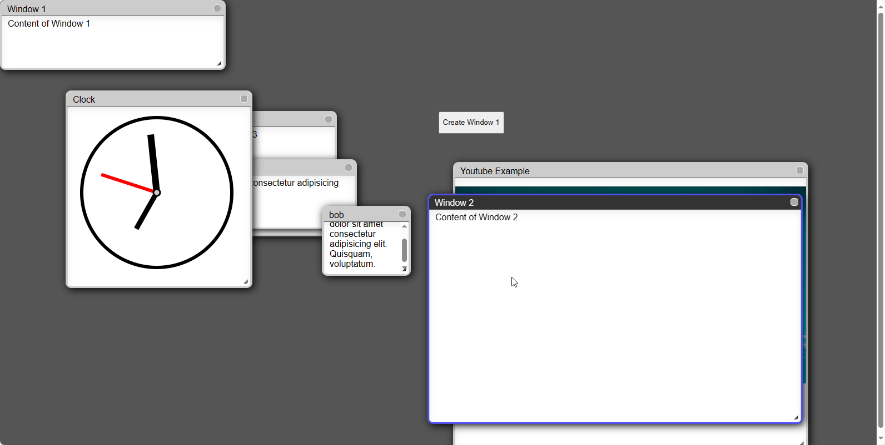

# Super Simple Javascript Window Manager



[](https://opensource.org/licenses/BSD-3-Clause)
[](https://github.com/g023/Super-Simple-Javascript-Window-Manager)

A simple minimalist window manager for javascript that uses jquery, jquery-ui.

## Features
- Draggable windows
- Resizable windows
- Closeable windows
- Focus window
- Set CSS
- Set content

## Usage
```html
<script src="https://ajax.googleapis.com/ajax/libs/jquery/3.5.1/jquery.min.js"></script>
<script src="https://code.jquery.com/ui/1.13.0/jquery-ui.js"></script>
<link rel="stylesheet" href="https://code.jquery.com/ui/1.13.0/themes/smoothness/jquery-ui.css">

<script src="Simple_Window.js"></script>

<script>
    // Usage example
    const window1 = new Simple_Window('Window 1', '<p>Content of Window 1</p>');
    window1.createWindow('bob');
    window1.setCss('width', 400);
    window1.setCss('height', 100);
</script>
```

For more usage examples and detailed documentation, visit [Super Simple Javascript Window Manager](https://github.com/g023/Super-Simple-Javascript-Window-Manager).

## Author
- [g023](https://github.com/g023)